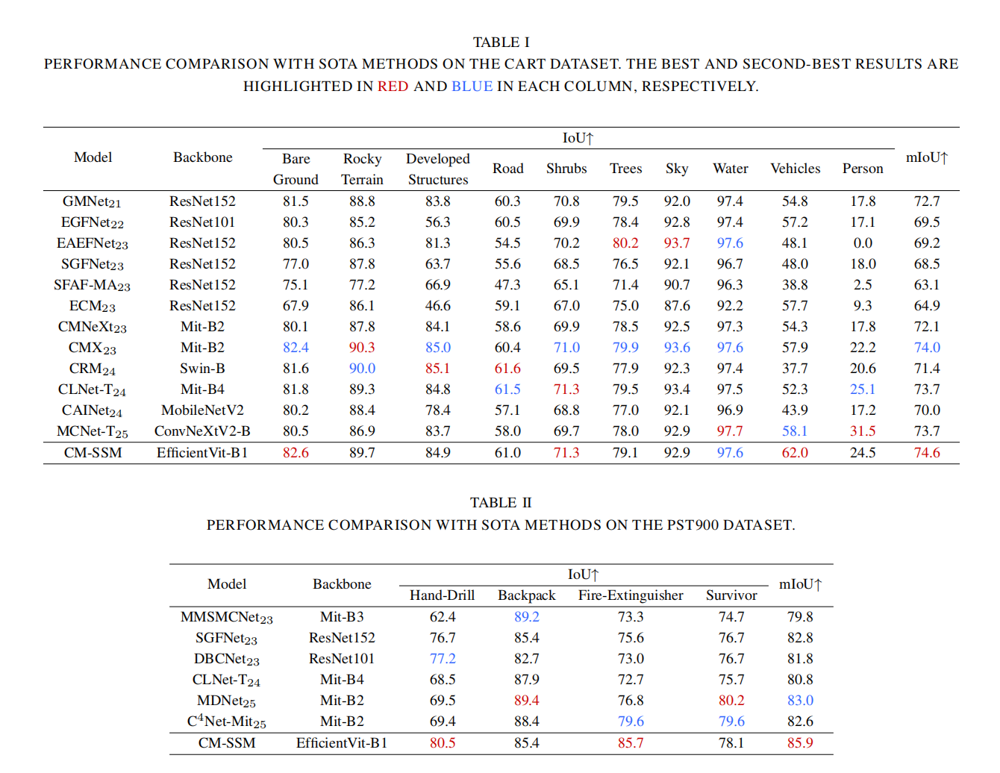

# Cross-modal State Space Modeling for Real-time RGB-Thermal Wild Scene Semantic Segmentation
## Introduction
This repository contains the code for the paper "Cross-modal State Space Modeling for Real-time RGB-Thermal Wild Scene Semantic Segmentation," which has been accepted by IROS 2025.
**Updating** ✨: An extended version of our conference paper has been submitted to TCSVT. More details and codes can be found [here](your-link-here).
## Method 

The CM-SSM consists of two image encoders to extract the features of RGB and thermal images, four CM-SSA moudules to perform RGB-T feature fusion in four stages, and an MLP decoder to predict the semantic segmentation maps.

The CM-SS2D consists of three steps: 1) cross-modal selective scanning, 2) cross-modal state space modeling and 3) scan merging.
## Reqiurements
Python==3.9  
Pytorch==2.0.1  
Cuda==11.8  
mamba-ssm==1.0.1  
selective-scan==0.0.1  
mmcv==2.2.0  
## Dataset and Results

| Models | Dataset  | mIoU | Weights|
|------|------------|------|--------------|
| CM-SSM    | [CART](https://github.com/aerorobotics/caltech-aerial-rgbt-dataset)      | 74.6   | [pth](https://github.com/xiaodonguo/CMSSM/releases/download/v1.0.0/CART.pth)     |
| CM-SSM   | [PST900](https://github.com/ShreyasSkandanS/pst900_thermal_rgb)     | 85.9    | [pth](https://github.com/xiaodonguo/CMSSM/releases/download/v1.0.0/PST900.pth)     |
# Concat
If any questions, please contact 3120245534@bit.edu.cn.
