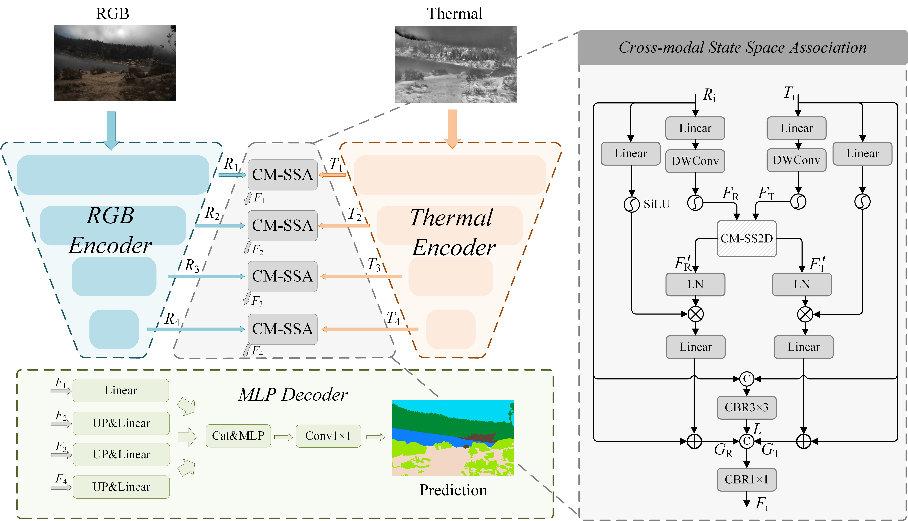

# Cross-modal State Space Modeling and Terrain-specific Knowledge Distillation for RGB-Thermal Semantic Segmentation
## Introduction
This repository contains the code for the paper "Cross-modal State Space Modeling for Real-time RGB-Thermal Wild Scene Semantic Segmentation," which has been accepted by IROS 2025.

✨**2025-10-15**✨ : An extended version of our conference paper, "Cross-modal State Space Modeling and Terrain-specific Knowledge Distillation for RGB-Thermal Semantic Segmentation", has been submitted to TASE. For the convenience of the review process, more details and codes are provided. 

## Method 

The CM-SSM consists of two image encoders to extract the features of RGB and thermal images, four CM-SSA moudules to perform RGB-T feature fusion in four stages, and an MLP decoder to predict the semantic segmentation maps.

The CM-SS2D consists of three steps: 1) cross-modal selective scanning, 2) cross-modal state space modeling and 3) scan merging.

## Reqiurements
Python==3.9  
Pytorch==2.0.1  
Cuda==11.8  
mamba-ssm==1.0.1  
selective-scan==0.0.1  
mmcv==2.2.0  

| Models |Backbone| Dataset  | mIoU | Weights|
|------|------|------------|------|--------------|
| CM-SSM|EfficientVit-B1    | [CART](https://github.com/aerorobotics/caltech-aerial-rgbt-dataset)      | 75.1   | [pth](https://github.com/xiaodonguo/CMSSM/releases/download/v1.0.1/CART.pth)     |
| CM-SSM|EfficeintVit-B1   | [PST900](https://github.com/ShreyasSkandanS/pst900_thermal_rgb)     | 85.9    | [pth](https://github.com/xiaodonguo/CMSSM/releases/download/v1.0.1/PST900.pth)     |
| CM-SSM|ConvNeXtV2-A    | [SUS](https://github.com/xiaodonguo/SUS_dataset)      | 82.5   | [pth](https://github.com/xiaodonguo/CMSSM/releases/download/v1.0.1/SUS.pth)     |
| CM-SSM|ConvNeXtV2-A   | [FMB](https://github.com/JinyuanLiu-CV/SegMiF)     | 60.7    | [pth](https://github.com/xiaodonguo/CMSSM/releases/download/v1.0.1/FMB.pth)     |
